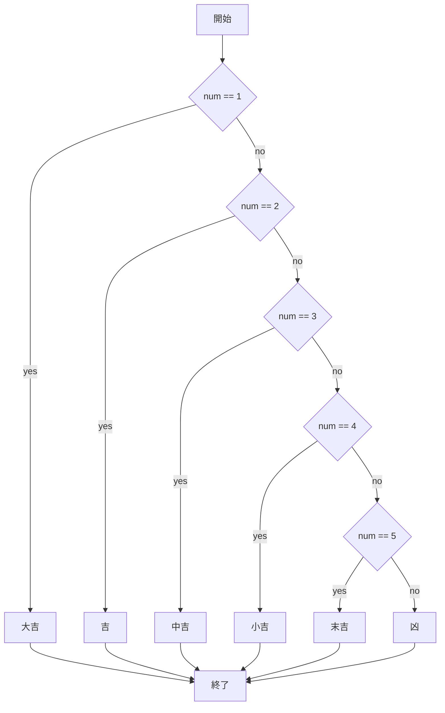
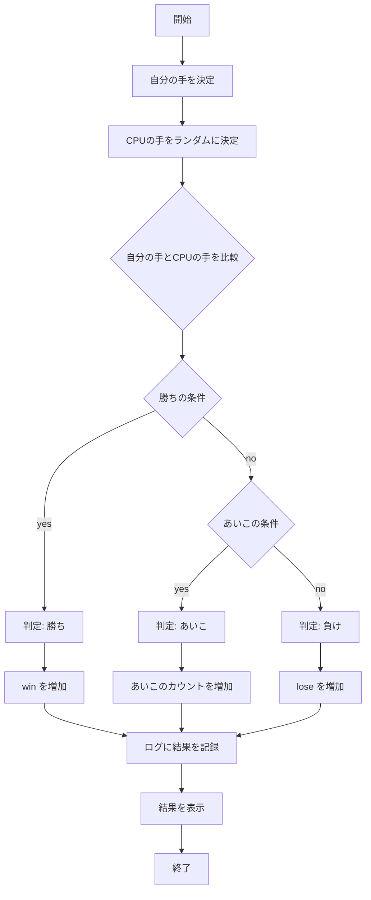
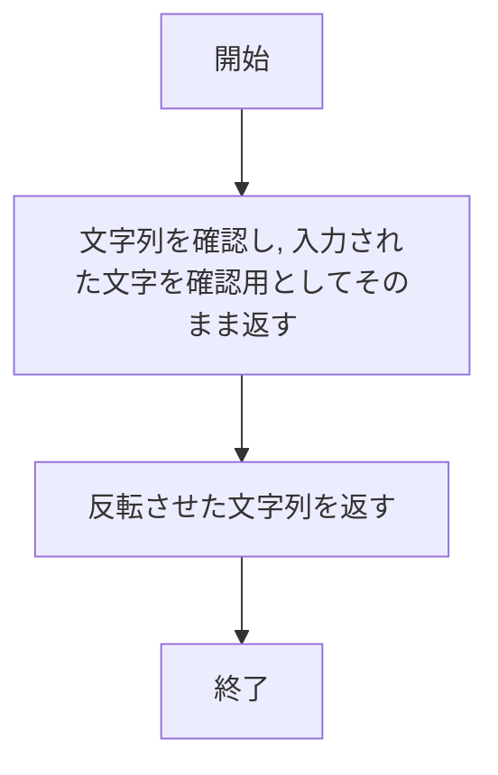
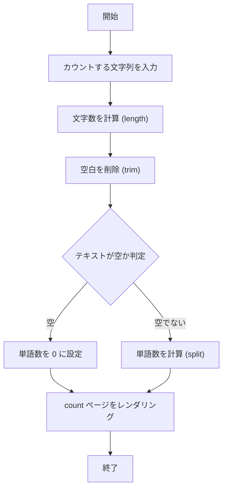

# webpro_06
2024/11/18

## 起動方法について
node.js と npm がインストールされていることを確認し, app5.js ファイルがあるディレクトリの中で node app5.js を実行してサーバーを起動させる. その後, ブラウザで http://localhost:8080/public/*****.html にアクセスすることによって, アプリケーションの機能を利用できる. 
*****は各々の開きたいページのhtml. 

## ファイル管理について
git add .

git commit -am'変更しました'

git push  

トークン名

これらを順に実行. 
## ファイル一覧
ファイル名|説明|
-|-
app5.js|プログラム本体|
public/janken.html | じゃんけんの開始画面 |
views/janken.ejs | じゃんけんのテンプレートファイル |
public/reverse.html | 文字列反転の開始画面 |
views/reverse.ejs|文字列反転のテンプレートファイル |
public/count.html | 文字数・単語数カウントの開始画面 |
views/count.ejs | 文字数・単語数カウントのテンプレートファイル|

### app5.js内のプログラム一覧
プログラム名|説明|
-|-
hello1|Hello worldとBon jourを出力する|
hello2|greet1, greet2に格納されたHello worldとBon jourを出力する|
icon|Appleのロゴを表示する|
luck|1から6のなかで乱数を生成し, その文字ごとにおみくじ結果を割り振る|
じゃんけん|1から3の乱数を所得し, 1ならグー, 2ならチョキ, ３ならパーをcpuの手とする. ユーザーにグー, チョキ, パーのいずれかの文字を入力させ, じゃんけんのルールに従って勝敗を決める |

## 機能ごとの説明と使用手順
### 挨拶メッセージ1
サーバーを起動し, http://localhost:8080/hello1
にアクセスすることでユーザーに "Hello world"と"Bon jour"を表示する. 

### 挨拶メッセージ2
サーバーを起動し, http://localhost:8080/hello2
にアクセスすることでユーザーにgreet1, greet2に格納された文字列 "Hello world"と"Bon jour"を表示する. 

### アイコン画面表示
サーバーを起動し, http://localhost:8080/icon
にアクセスすることでユーザーに アイコン画像が表示される(Appleロゴ). 

### 運勢占い
サーバーを起動し, http://localhost:8080/luck
にアクセスすることで運勢が表示される. 
1~6の中で乱数を生成, 1ならば大吉, 2ならば吉, 3ならば中吉, 4ならば小吉, 5ならば末吉, 6ならば凶を出力する. 

### じゃんけん
サーバーを起動し, http://localhost:8080/public/janken.html　
にアクセスしてグー, チョキ, パーのいずれかを選択することで勝敗が表示される. 

1. app5.js を起動する
1. Webブラウザでlocalhost:8080/public/janken.htmlにアクセスする
1. 出したい手を入力する

### 文字列反転
サーバーを起動し, http://localhost:8080/public/reverse.html　
にアクセスして文字列を入力することで, その文字列を反転したメッセージが表示される. 

1. app5.js を起動する
1. Webブラウザでlocalhost:8080/public/reverse.htmlにアクセスする
1. 反転させたい文字列を入力する

### 文字数・単語数カウント
サーバーを起動し, http://localhost:8080/public/count.html
にアクセスして文字列を入力することで, その文字列の文字数, 単語数が表示される. 

1. app5.js を起動する
1. Webブラウザでlocalhost:8080/public/count.htmlにアクセスする
1. カウントしたい文字列を入力する

